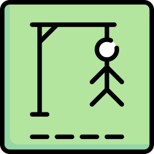

# 🪓 ForcaMaster Pro

<p align="center">
  
</p>

<p align="center">
  <strong>O clássico Jogo da Forca reinventado: 100% Offline-First, áudio procedural sintetizado via Web Audio API, ultra-responsivo, com suporte pleno à língua portuguesa, desafios remotos sem servidor e inteligência artificial generativa.</strong>
</p>

<p align="center">
  
  
  
  
  
</p>

---

## 🌟 Visão Geral

O **ForcaMaster Pro** é uma aplicação web progressiva (PWA) de alto padrão de engenharia e refinamento de UI/UX, construída com foco em **Zero-Asset Overhead**, portabilidade absoluta e suporte irrestrito ao vocabulário da língua portuguesa.

Inspirado na arquitetura modular e descentralizada do ecossistema [QuizMaster](https://deysonsantana.github.io/quizMaster/), o projeto opera sem frameworks pesados ou etapas complexas de compilação, utilizando **padrões nativos modernos da Web (ES6 Modules, Canvas API, Web Audio API e Cache Storage)**.

---

## ✨ Principais Funcionalidades

### 1. 📶 100% Offline-First & Instalável (PWA)
- **Service Worker Resiliente (`service-worker.js`):** Implementa estratégia de cache inteligente (*Cache-First com fallback de rede*), permitindo que o jogo abra instantaneamente sem conexão com a internet.
- **Instalação Nativa:** Funciona em tela cheia (*standalone display*) em celulares Android, iOS, tablets e desktops através do `manifest.json`.

### 2. 🎵 Síntese Sonora Procedural Nativa (Web Audio API)
- **0kb de Áudio Externo:** Sem requisições de arquivos `.mp3` ou `.wav`. Os efeitos são sintetizados matematicamente em tempo real usando osciladores (`sine`, `triangle`, `sawtooth`) e envelopes de ganho:
  - Tique suave ao clicar ou digitar teclas.
  - Acordes harmônicos ascendentes nos acertos.
  - Buzzer atenuado nos erros.
  - Fanfarra triunfante na vitória e drone dramático na derrota.
  - Chime para dicas e alternância de temas.

### 3. 🇧🇷 Suporte Integral ao Português (Acentos & Diacríticos)
- **Acentuação Gráfica Real:** Palavras como `PÃO DE AÇÚCAR`, `CORAÇÃO`, `ÁGUA-DE-COLÔNIA` e `PARALELEPÍPEDO`.
- **Adivinhação Transparente:**
  - Digitar a letra **"A"** descobre automaticamente `A`, `Á`, `À`, `Â` e `Ã`.
  - Digitar a letra **"C"** ou **"Ç"** descobre `C` e `Ç` com sincronização visual simultânea no teclado.
- **Caracteres Especiais Automáticos:** Hífens (`-`), apóstrofos (`'`), espaços e pontuações são exibidos abertos como separadores, sem contar erros.

### 4. 📱 Responsividade Extrema (Mobile-First)
- **Viewport Dinâmico (`100dvh`):** Elimina o salto indesejado de barra de endereços móvel.
- **Safe Area Insets:** Compatibilidade com entalhes (*notches*) de iPhone e Android.
- **Quebra Inteligente por Palavras (`.word-group`):** As letras nunca quebram ao meio em telas compactas (320px a 390px).
- **Zero Tap Delay:** Diretiva `touch-action: manipulation` para resposta tátil instantânea no toque.

### 5. 🔗 Desafios Descentralizados via Hash URL & QR Code
- Crie palavras personalizadas com dica opcional e gere links encriptados em Base64 UTF-8 no fragmento da URL (`#challenge=PAYLOAD`).
- **QR Code Canvas Local:** Motor gerador nativo em `<canvas>` de alta densidade sem depender de APIs de terceiros.
- **Modo 2 Jogadores Local:** Digite uma palavra secreta para um amigo jogar no mesmo aparelho imediatamente.

### 6. 🤖 Desafios Infinitos com IA Generativa (Google Gemini)
- Arquitetura **BYOK** (*Bring Your Own Key*) conectada à API do Google Gemini.
- Gere enigmas customizados e dicas inteligentes sobre qualquer assunto (*ex: "Física Quântica", "Filmes dos Anos 80", "Biologia Marinha"*).

### 7. 🎨 5 Temas Visuais Semânticos
Alternância instantânea de temas com persistência no `localStorage` e sincronização da cor da barra de status móvel (`theme-color`):
- 🔴 **Nintendo Arcade:** Tema clássico com vermelho icônico, branco e cinza escuro.
- ⚡ **Dark Neon:** Ciano vibrante com fundo escuro profundo e acento verde neon.
- 🟣 **Cyberpunk:** Magenta vibrante e roxo neon sobre preto.
- 🟢 **Emerald Matrix:** Tons de esmeralda e verde escuro.
- 🌑 **Midnight AMOLED:** Preto absoluto (`#000000`) para máxima economia de bateria em telas OLED.

### 8. 🏆 Painel de Estatísticas & Backup Físico
- Histórico completo: vitórias, derrotas, win rate, sequência atual, melhor sequência e pontuação total.
- **Portabilidade de Dados:** Exportação e importação de backups em formato `.json`.

---

## 🗺️ Arquitetura de Módulos

```
app-forca/
├── index.html                   # Estrutura semântica e acessível (WCAG 2.1 AA)
├── style.css                    # Design system com tokens para os 5 temas e layout fluido
├── manifest.json                # Metadados PWA e configuração standalone
├── service-worker.js            # Cache-First resiliente com rotas relativas
├── js/
│   ├── app.js                   # Orquestrador SPA central e ciclo de vida
│   ├── audio.js                 # Motor de síntese procedural (Web Audio API)
│   ├── themeManager.js          # Gestão dinâmica dos 5 temas CSS
│   ├── words.js                 # Vocabulário categorizado e normalização de acentos
│   ├── gameEngine.js            # Regras de negócio, erros, slots e pontuação
│   ├── keyboard.js              # Teclado ergonômico Fitts/Jakob com feedback RGB
│   ├── statsManager.js          # Estatísticas, histórico e backup JSON
│   ├── shareManager.js          # Desafios remotos via Hash (#challenge) e QR Code Canvas
│   └── aiService.js             # Integração com a API do Google Gemini (BYOK)
└── assets/icons/                # Ícones em alta resolução para PWA
```

---

## 🚀 Como Executar Localmente

Como a aplicação utiliza **ES6 Modules**, é recomendado servi-la através de um servidor local estático simples:

### Opção 1: VS Code Live Server
Abra a pasta do projeto no VS Code e clique em **"Go Live"**.

### Opção 2: Node.js (npx serve / http-server)
```bash
# Usando npx serve
npx serve .

# Ou usando http-server
npx http-server -p 8080 .
```

### Opção 3: Python
```bash
# Python 3
python -m http.server 8000
```

Acesse no navegador em `http://localhost:8000`.

---

## 🌐 Deploy no GitHub Pages

O projeto está 100% pronto para publicação no GitHub Pages:

1. Acesse o repositório no GitHub: **Settings > Pages**.
2. Em **Branch**, selecione `main` e a pasta `/ (root)`.
3. Clique em **Save**.
4. Sua aplicação estará disponível e instalável como PWA!

---

## 📄 Licença

Distribuído sob a licença **MIT**. Consulte `LICENSE` para mais informações.

---

<p align="center">
  Desenvolvido com excelência técnica por <strong>Deyson Santana</strong>.
</p>
